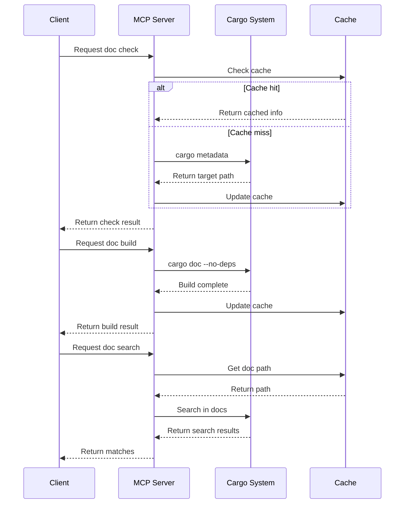

# Docs.rs MCP Implementation Plan

## 1. System Architecture

### Core Components

- DocManager: Manages documentation related operations
- Cache System: Stores built documentation paths
- Command Executor: Handles cargo command execution
- MCP Tools: Interface for client interactions

### Tools

1. check_doc: Verify if documentation is built
2. build_doc: Build documentation for a crate
3. search_doc: Search within documentation

## 2. Technical Stack

- Language: TypeScript
- Command Execution: execa
- Interface: MCP SDK
- Environment: Node.js

## 3. Workflow



## 4. Tool Interface Design

```typescript
interface Tools {
  // Check if documentation is built
  check_doc: {
    project_path: string; // Rust project path
    crate_name: string; // crate name
  };

  // Build documentation
  build_doc: {
    project_path: string; // Rust project path
    crate_name: string; // crate name
    no_deps?: boolean; // optional: don't build dependencies
  };

  // Search documentation
  search_doc: {
    project_path: string; // Rust project path
    crate_name: string; // crate name
    query: string; // search keyword or symbol
    limit?: number; // optional: limit result count
  };
}
```

## 5. Implementation Steps

### Phase 1: Core Functionality

1. Create DocManager class

   - Initialize cache system
   - Implement path resolution
   - Handle cargo command execution

2. Implement cache system

   - Store documentation paths
   - Cache validation
   - Automatic cleanup

3. Command execution wrapper

   - Execute cargo commands
   - Parse command output
   - Handle errors

4. Search functionality
   - Parse documentation HTML
   - Implement search logic
   - Format search results

### Phase 2: MCP Integration

1. Register tools with MCP server
2. Implement request handlers
3. Add error handling
4. Format responses

### Phase 3: Documentation & Testing

1. Update README.md
2. Add usage examples
3. Document error handling
4. Add troubleshooting guide

## 6. Error Handling

- Invalid project path
- Cargo command failures
- Documentation build errors
- Search failures
- Cache system errors

## 7. Future Enhancements

- Support for workspace projects
- Advanced search options
- Documentation diff between versions
- Integration with docs.rs API
